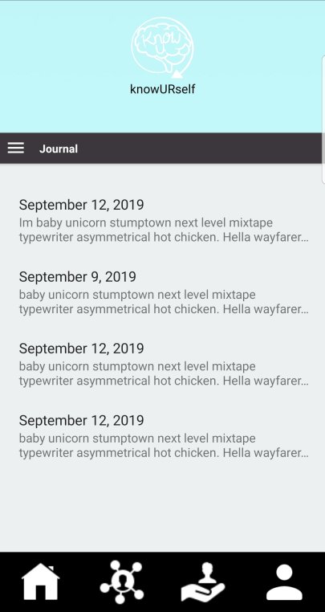
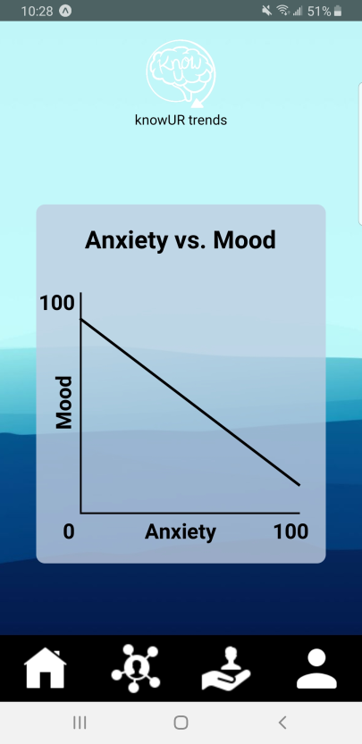
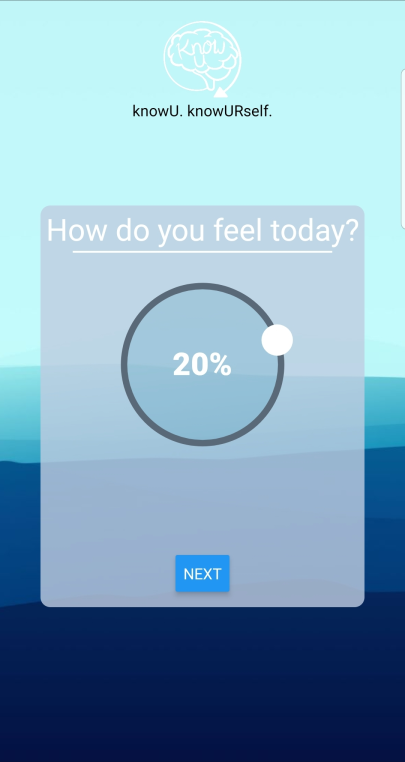
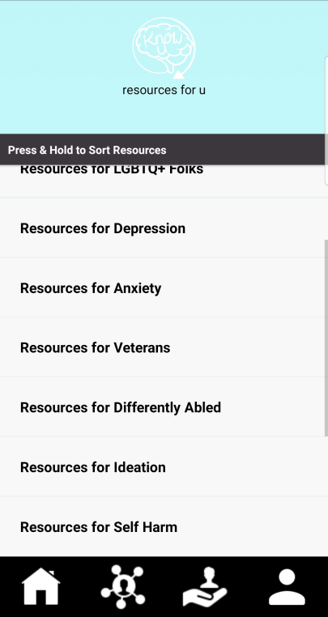

# What's the Problem?

A large portion of our global population are affected by one or more mental disorders. If we can support those who are in distress, we may move towards providing professional care and resources and, hopefully, ultimately reduce the suicide rate and improve quality of life. This project is centered on the third SDG goals: *Good Health and Well-Being*.

## Statistics
According to the [World Health Organization](https://www.who.int/):
- Depression affects over 264 million people
- 800,000 people die from suicide annually
- Suicide is the second leading cause of death for young adults

## Our Solution

We aim to support those who are in distress by proving a user-focused mental health app. Our solution is primarily targeted at those who often have and use their mobile phones. Our app aims to aid by providing a sense of mindfulness. We ask the user to complete a daily questionnaire that asks the user questions about their mood, anxiety, and other aspects of their life. With the data collected, we offer a week's glance of the user's mood as well as analytics. The analytics offers views of trends found within the data.

We may find that on days a user goes to classes, they experience the most anxiety. On days the user skips breakfast, their mood is often worse. We hope that by offering these insights to the user, they take a moment to reflect on these trends and consider actions they may take to improve their mental health.

### How Is This App Different Than Others?
- Open Source -- Anyone is able view and contribute to the source code
- Customizable -- Questionnaire is customizable to be tailored to the user
- Serverless -- Your data stays completely local and secured

### Technology
Our application is written within React Native, allowing for maximal portability between devices. 

# Research Methodology

```
- Explain your systematic literature review. How many papers did you read? Write a summary of your findings. Give the pictures of your group prototype
For this project we went through and read 12+ pieces of literature to get our heads around this project we were working on and how to best address this issue we were noticing. In short we were noticing that social media was having effects on peoples moods around the world. Their moods were beign affective possitively and negatively and that is what we wanted to study with our application.
- Explain your system analysis. How many systems did you analyze? Write a summary of your findings. Give the pictures of your updated group prototype
As a group we studied 8 systems and how they tackled social media and mental health tracking. We found that their are a lot of mental health applications that are avialable to people but not many that were going after wokring with people to help them understand what was going on while they were on social media. 
- Explain your user study. How many interviews did you conduct? Write a summary of your findings. Give the pictures of your updated group prototype
We conducted 4 interviews as a group. We found that our initial design of our project to be far to invasive. We had invisioned an application that would trace what a user was doing online and summaries what was going on in their online profiles and friends of their profiles. This led us to changing our application completely to adress this issue, so in turn we made it so that our goal was to just track how long someone was on an application and have them take a survey. Once that was done, we then would give them a genralized graph of their mood and the amount of time spent on an app.
```

# Final Product
```
- Discuss in detail the final prototype (every feature); Give pictures as needed.
- Discuss all the technologies/software/API you used.
- Provide the link of your code repository (e.g., GitHub)
```

 
 


## Video

# Future Works


# Developers
Morgan Stimpson - stimpsm@wwu.edu  
Selome Zerai - zerais@wwu.edu  
Alex Ayala - ayalaa2@wwu.edu  
Justin Hanson - hanson36@wwu.edu  
